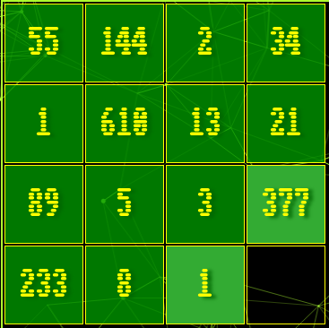

# Javascript GAMES by antoniobruchidev

## Demo

[Live website](https://antoniobruchidev.github.io/mp2-javascript-games/)

## One logic game

To win the game the user has to form the fibonacci sequence from top-left.

| FROM | TO   |
|:----:|:----:|
| |  |

It is a variant of the [15 Puzzle](https://en.wikipedia.org/wiki/15_Puzzle) created to simplify how to scramble the squares. Half of the combination using numbers from 1 to 15 will always be unsolvable. But using the Fibonacci sequence and validating the positions of the squares from 3 to empty all the combinations become possible because square one can be in position two and viceversa being both "1".
The application will use jQuery UI draggable and droppable plugin to let the user move the square only if next the the empty space until they are validated.

## One knowledge game

To win the game the user has to guess the correct characters included in a word, given its definition.
Classic Hangman!

The application use external API to both get random words and their definition, it will display the underscores for esch character present in the word and let the user guess the characters until is they are all guessed or game over after 7 mistakes.

## Table of Contents

- [Javascript GAMES by antoniobruchidev](#Javascript GAMES by antoniobruchidev)
  - [Table of Contents](#table-of-contents)
    - [UX](#ux)
    - [User stories](#user-stories)
      - [Strategy](#strategy)
      - [Scope](#scope)
      - [Structure](#structure)
      - [Skeleton](#skeleton)
        - [Wireframes](#wireframes)

## UX

The website targets people wanting to relax playing some games.

### User stories

- As a user I want to be able to play different kind of games.
- As a user I want to fully understand the rules and how to play each game.
- As a user I want to understand that my actions are recognized and interpreted well.
- As a user I want to be able to check my current score.

### Strategy

The goal is to make a well-functioning web application with which the user can interact and receive accurate responses.

### Scope

I want users to be able to enjoy a brief amount of their time.

### Structure

This web application is single page based, composed by a header and four sections sittin on top a moving background. Only one section of the first three sections is visible at the time and in mobile view the header is visible only in the landing page. The fourth section is the rules/landing page for both games. It acts as a modal stacking on top of the other layers. The javascript will handle what will be visible on each sections, dependind from the user's request.

**Website Sections:**
| Section                | Content                                                       |
|------------------------|---------------------------------------------------------------|
| Landing page           | A header and the choice between two different games           |
| Logic game page        | Logic game page                                               |
| Knowledge game page    | Knwoledge game page                                           |
| Rules game page        | Rules game page                                               |

### Skeleton

The website is designed to be clear and simple.

#### Wireframes

- [Home](assets/pdf/home-wireframe.pdf)
- [Logic Game](assets/pdf/logic-wireframe.pdf)
- [Knowledge Game](assets/pdf/knowledge-wireframe.pdf)

### Surface

I used greenyellow as color and black as background for most of the web application. I used yellow on darkgreen for the buttons.
As background I used [particle.js](https://github.com/marcbruederlin/particles.js) script with the other layers sitting on top of it with opacized background colors.

## Technologies

1. HTML - To create a basic site.
2. CSS - To create a nice, standout front-end and to give a great user experience.
3. JS - To have nice moving backgroun, game states.
4. jQuery UI - Starting with the web app navigation, I'll use it for mostly everything in this progject.
5. GIMP - To elaborate images.
6. RapidAPI - [To retrieve 10 random words](https://rapidapi.com/st-s2DBxyBlu/api/a-randomizer-data-api)
7. RapidAPI - [To retrieve the definition of a single word](https://rapidapi.com/twinword/api/word-dictionary)
8. VS Code - as an IDE
9. git and github - for deployment and version control.
10. Balsamiq - for the wireframes

## Features

### Existing features

#### Game choice

The user has a choice of two different games.

#### Explanations

The user is given explanations in both games

#### Game buttons - New game - Rules - Home - changing color when hovering

The user is signaled when he's hovering a button by changing the button style, 

#### Blinking new game button

The user is signaled to click the new game button when a game is finished or not yet started
[Watch the video](https://github.com/antoniobruchidev/mp2-javascript-games/assets/149312281/eea0b728-85fa-4194-9aef-bd5cae402eb6)
[Watch the video](https://github.com/antoniobruchidev/mp2-javascript-games/assets/149312281/9e82c25c-ea2f-4df5-90c7-6fc464f10be7)

#### Start a new game

The user start a new game
[Watch the video](https://github.com/antoniobruchidev/mp2-javascript-games/assets/149312281/cbb9dfab-efd9-4425-bb94-800e2c40e5c6)
[Watch the video](https://github.com/antoniobruchidev/mp2-javascript-games/assets/149312281/15ef49fc-f606-4b8b-bd36-c7c2e89ed880)

#### Fully interactive

The user can fully interact with the widget, it signals the user which square are draggable, both by changing the cursor and highlighting the square.
It fully adjust when the square is dropped and when it is reverted it turn the backlight on again.

[Watch the solution](https://github.com/antoniobruchidev/mp2-javascript-games/assets/149312281/a968d996-f8f3-4c6a-ad74-40aba1cfdab7)

The user has an accurate response when guesses a character by turning the background color to classics like green and red for success and fail.
It disable the character guessed so the user cannot guess it again. Turns the displayed keyboard green or red at the end letting the new game button blink again.
It also displays a hint at the second mistake.

[Watch the video](https://github.com/antoniobruchidev/mp2-javascript-games/assets/149312281/355a07da-56d9-46db-bcf7-f20e78777de6)

#### Score

The user can see his moves adding up and a timer showing
[Watch the video]()

## Testing

### HTML

[Nu HTML checker](https://validator.w3.org/nu/?doc=https%3A%2F%2Fantoniobruchidev.github.io%2Fmp2-javascript-games%2F)

### CSS

### JS

Javascript passes throught the JSLint extension for VSCode with only warnings

### Accessibility
- [Contrast Main](https://webaim.org/resources/contrastchecker/?fcolor=ADFF2F&bcolor=000000)
- [Contrast Buttons](https://webaim.org/resources/contrastchecker/?fcolor=FFFF00&bcolor=007800)
- [Contrast Widget](https://webaim.org/resources/contrastchecker/?fcolor=FFFF00&bcolor=229A22)
- [Contrast Keyboard](https://webaim.org/resources/contrastchecker/?fcolor=ADFF2F&bcolor=303030)
- [Contrast Keyboard Fail](https://webaim.org/resources/contrastchecker/?fcolor=000000&bcolor=FF0000)
- [Contrast Keyboard Success](https://webaim.org/resources/contrastchecker/?fcolor=ADFF2F&bcolor=008000)

### Testing user stories

- [As a user I want to be able to play different kind of games.](#game-choice)
- [As a user I want to fully understand the rules and how to play each game.](#explanations)
- [As a user I want to understand that my actions are recognized and interpreted well.](#fully-interactive)
- [As a user I want to be able to check my current score.](#score)

## Credits

1. [Moving background](https://github.com/marcbruederlin/particles.js)
2. [Loading Bar](https://css-loaders.com/progress/)

